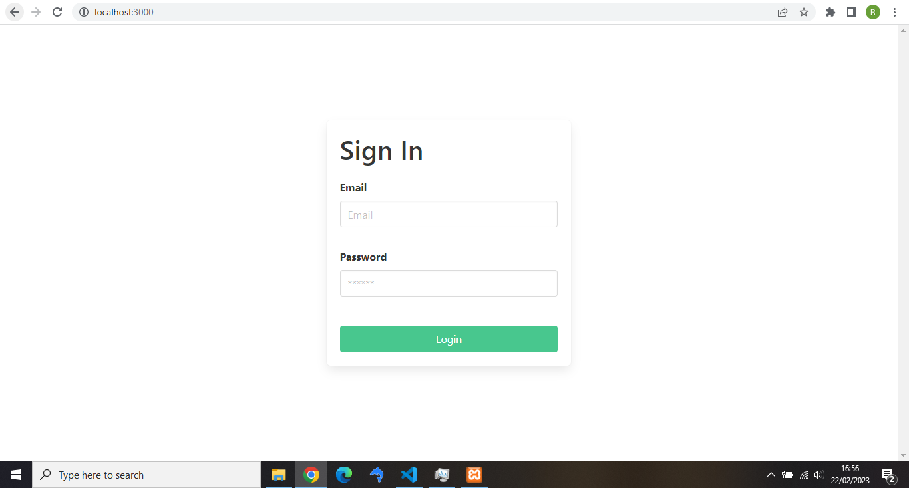
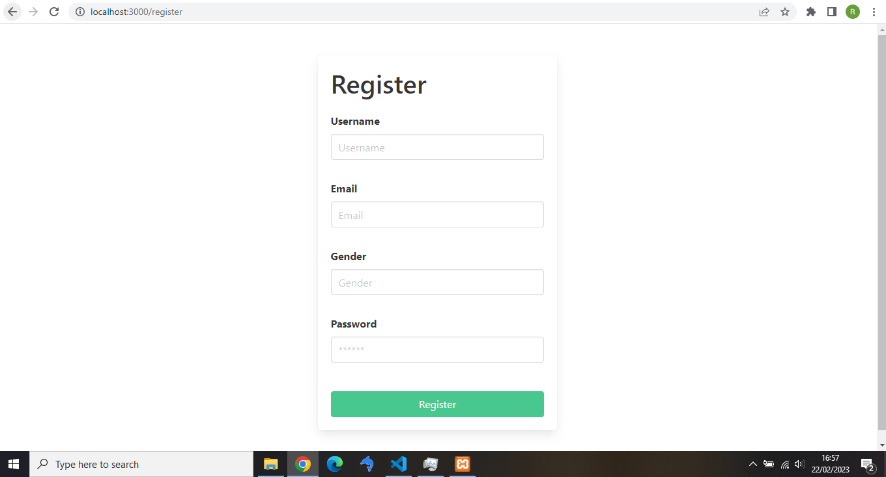
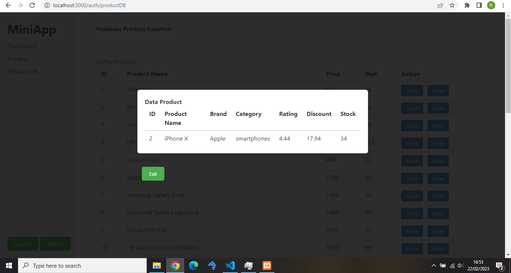
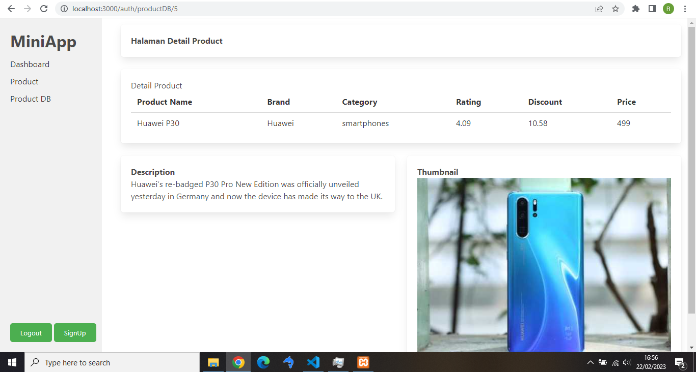
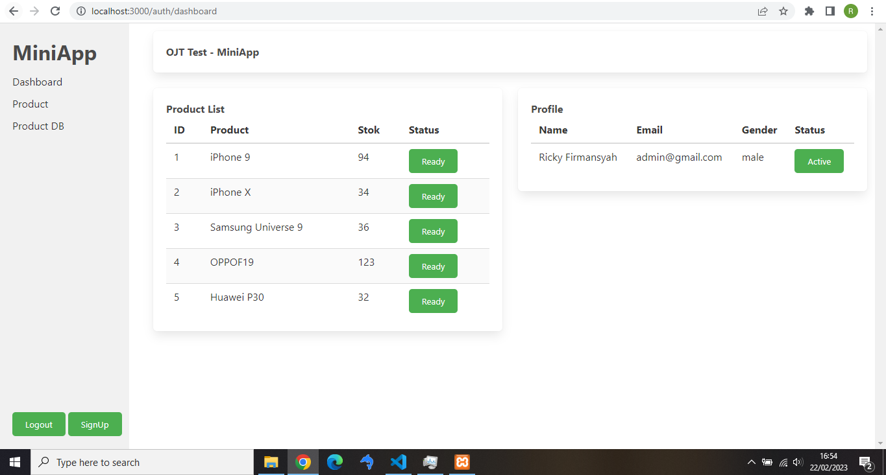
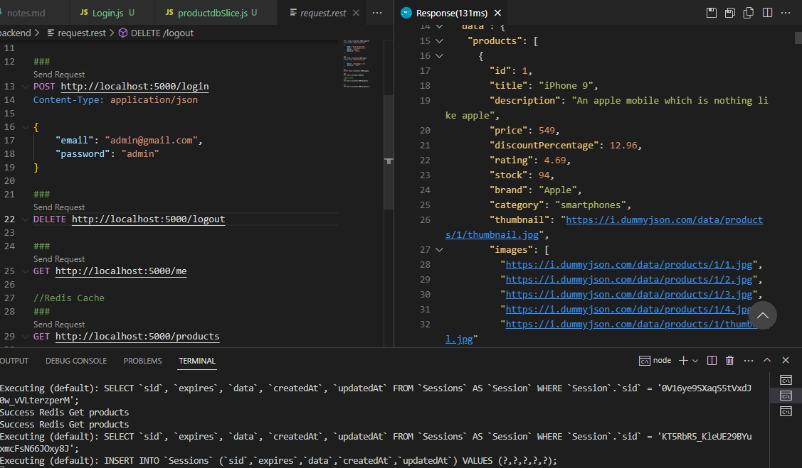
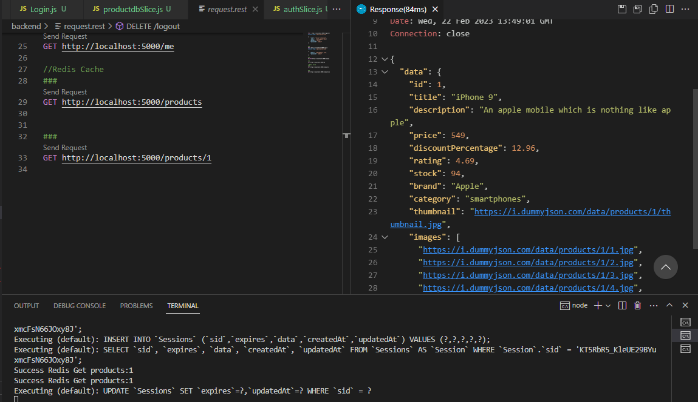

# OJT MINIAPP - TEST

Note :
- Terdapat Bug pada roload halaman dimana ketika user login seharusnya membawa session namun ketika 
  dialihkan ke dashboard halaman di reload dan redux dev tool tidak membacanya
- Terdapat bug ketika fecth data dummyjson, pada redux dev tool telah berisi data dengan action fullfield
  namun data tidak tampil pada table
  
Fixed : 
 -Sidebar dan Navbar menjadi pilihan untuk tampilan frontend, bug terdapat ketika reload untuk memunculkan sidebar
  jika menggunakan Navbar dapat di fixed namun tampilan akan berubah menjadi kurang menarik dan menambahkan
  logic untuk beralih ke login jika session belum tersedia
 -Menggunakan dj.json untuk get datanya (memang dirasa kurang, namun semua implementasi untuk soal OJT bisa berjalan
  sebagaimana mestinya)

#### Screenshoot LoginPage
Login Page

#### Screenshoot 2
Register Page

#### Screenshoot 3
Modal Product

#### Screenshoot 4
Detail Product

#### Screenshoot 5
Dashboard

####Backend
Get Redis

####Backend
Get Redis by ID

